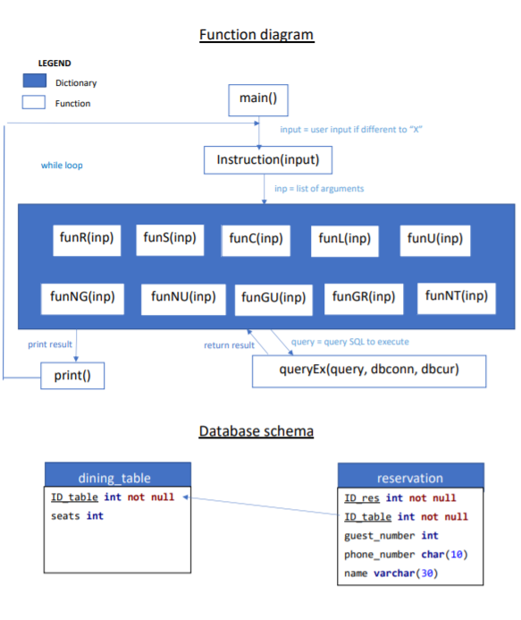

# Dinner Booking CLI

Program to build a simplified and proof-of-concept software application  for managing an electronic table reservation book for a restaurant in the evening of a specific day. The software is composed  of a user interface and business logic part  written in Python and an SQL database management system (MySQL) to store the data.

The following an abstraction of my function and database's table:

The dining_table contains 12 tables: 3 tables with 2 seats, 2 tables with 3 seats, 3
tables with 4 seats, 2 tables with 5 seats, 2 tables with 6 seats. The number of seats
overall is 46.
Beyond the errors requested from assignment I added also others situation that can
return back an Error:

- If the number of guests is not a number but a character, the program returns
“Error”.
- If at least one characters inside a phone number are not a number or if the
length of phone number is different to 10, the program returns “Error”.
- If the code command entered by user is not inside a key of dictionary in which
there are all of function, the program returns “Error”.
- If there is not table available when the user would to enter a new booking,
the program returns “Error”.
- If the user would like to delete a booking but this booking not exist, the
program returns “Error”.
- If the user enters more or less than required argument or command, the
program returns “Error”.
